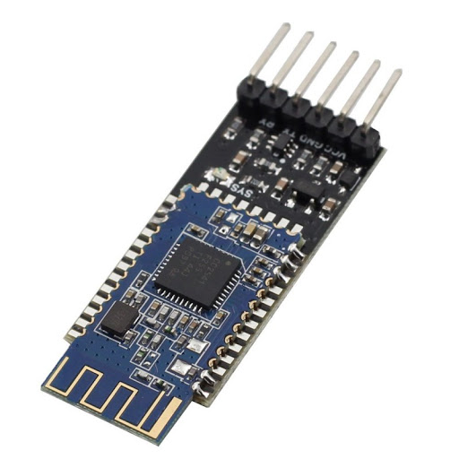
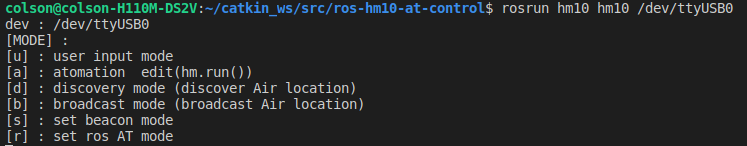

# ROS-HM10 command


ROS에서 hm10 AT 명령어 사용하기.

hm10 제작사 홈페이지, 
```
http://jnhuamao.cn/bluetooth.asp?id=1
```


### 사용법/usage
#### run
```
$: rosrun hm10 hm10 /dev/tty${device name}
```


#### topic name : std_msgs::String
```
/HM/command
```